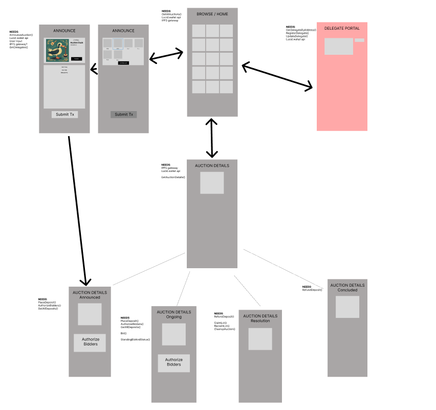
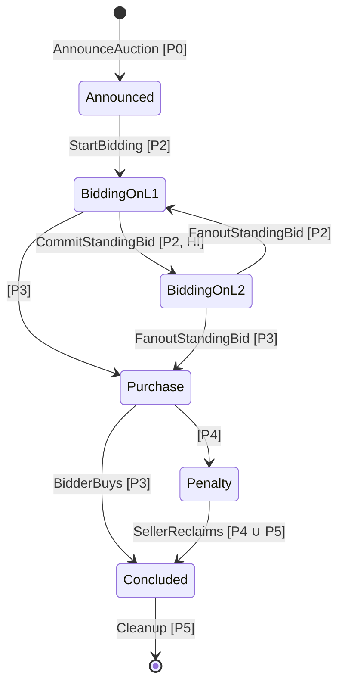

# Contents
1. [Users and Lifecycle](#users-and-lifecycle)
2. [User Needs](#user-needs)
3. [Pages](#pages)
4. [Appendix](#appendix---auction-state-machine)

# Users and Lifecycle

## Types of Users

- Sellers
- Bidders
	- Winner
	- Losers
- Delegates

## Auction Lifecycle
Based on auction state machine from protocol spec - appended at end of doc.

- ∅ (Unannounced)
- Announced 
- Ongoing
	- Bidding on L1
	- Bidding on L2
- Resolution
	- Pre Claim Deadline
	- Post Claim Deadline
- Concluded

# User Needs
Note: the assumption for v1 of this specification is that transactions which require delegate signatures, such as MoveToL2, will be handled separately by delegate infrastructure.

## Overview

<table><tr><td>

<table>
    <thead>
        <tr>
            <th rowspan=2 colspan=2>User Needs</th>
            <th rowspan=2>All Users</th>
            <th rowspan=2>Seller</th>
            <th colspan=2>Bidder</th>
        </tr>
		<tr>
            <th>Winner</th>
            <th>Loser</th>
		</tr>
    </thead>
    <tbody>
        <tr>
            <th colspan=2>∅</td>
			      <td>Browse Auctions</td>
            <td>Announce Auction</td>
            <td colspan=2></td>
        </tr>
		    <tr>
            <th colspan=2>Announced</td>
			      <td rowspan=5> View Auction Details</td>
            <td>
              Authorize Bidders, 
              Start Bidding
            </td>
            <td>Place Deposit</td>
            <td></td>
        </tr>
        <tr>
            <th rowspan=2>Ongoing</td>
            <th>Bidding on L1</td>
            <td rowspan=2>Authorize Bidders</td>
            <td rowspan=2 colspan=2>
              Place Deposit, 
              Bid
            </td>
        </tr>
		    <tr>
            <th>Bidding on L2</td>       
        </tr>
		    <tr>
            <th rowspan=2>Resolution</td>
            <th>Pre Claim Deadline</td>
            <td></td>
            <td>Claim Lot</td>
            <td rowspan=3> Refund Deposit </td>
        </tr>
		    <tr>
            <th>Post Claim Deadline</td>
            <td>Reclaim Lot</td>
            <td></td>
        </tr>
		    <tr>
            <th colspan=2>Concluded</td>
            <td>
              Cleanup Auction, 
              View Auction Results?
            </td>
            <td></td>
            <td></td>
        </tr>
    </tbody>
</table>

## General User Needs
#### ∅ (All States)
 - Browse Auctions
#### Announced, Ongoing, Resolution
- View Auction Details
#### Concluded
- View Auction Results?
## Seller Needs

#### ∅ (All States)
- Announce Auction
#### Announced 
- Authorize Bidders
- Start Bidding
- Cancel Auction?
#### Ongoing
- Authorize Bidders
#### Resolution
###### Post Claim Deadline:
- Reclaim Lot
#### Concluded
- Cleanup Auction

## Bidder Needs

#### ∅ (All States)
#### Announced 
- Place Deposit
#### Ongoing
- Place Deposit
- Bid
#### Resolution
- Reclaim Deposit (Losers Only)
###### Before Claim Deadline:
- Claim Lot (Winner Only)
#### Concluded
- Reclaim Deposit (Losers Only)

# Pages

Figma available to view [here](https://www.figma.com/file/E3pEaCHWDZG4mN21nHhXje/Hydra-UX-Design?type=design&node-id=0%3A1&mode=design&t=JQLt5enItpF7pOFF-1).

Note: the delegate portal page shown here will not be included in v1 of the UI design.

## Browse
Display:
- Active Auctions

## Create Auction
Allow Seller:
  - Define Auction Terms (Probably want to abstract some of these)
    - Lot
    - Start, End & Purchase, and Cleanup Times
    - Starting Bid
    - Minimum Increment?
    - Minimum Deposit?
    - Delegates?
    - Delegate Fees?
  - Submit Auction Creation Tx

## Auction Details
This page will have four separate states - Upcoming/Announced, Ongoing, Resolving, Concluded

Display:
 - Auction Lot Details (Assume single NFT for now?)
 - Standing Bid

### Upcoming Auction Details
Display:
  - Auction Start Time | "Waiting for Seller..."
    - This is the *earliest* start time, seller determines actual start with the StartBidding tx. 

Allow Seller:
  - View & Authorize Bidders (should this be a new page?)
  - Start Bidding

Allow Bidders:
  - Place Deposit

### Ongoing Auction Details
Display:
  - Time Left

Allow Seller:
  - View & Authorize Bidders

Allow Bidder:
  - Place Deposit
  - Bid

### Resolving Auction

Display:
 - Reclaim Deadline

Allow Winner:
  - Claim Lot (Before Claim Deadline)

Allow Loser:
  - Reclaim Deposit

Allow Seller:
 - Reclaim Lot (After Claim Deadline)

Allow Any?:
- Cleanup Auction (After Cleanup Deadline)

### Concluded Auction
Display:
 - Auction Result

Allow Loser:
 - Reclaim Deposit

# Appendix - Auction State Machine
(copied from https://github.com/mlabs-haskell/hydra-auction/blob/c3169e8cd531225412c7b09cc4687fdded9b0e6a/docs/domain_logic.md)

An auction can be modelled by the following state machine.
Here we use the UML statechart formalism,
whereby each transition is labelled as
`input [condition]`.
A conjunction of multiple conditions is labelled
as `[condition1, condition2, ...]`.
We omit the outputs of each state transition.

The state transitions are as follows:

<table><tr><td>

`AnnounceAuction [P0]`. Before the auction announcement time `T0`,
the seller can announce the auction via an L1 blockchain transaction
that locks the auction lot into the auction escrow
and specifies the terms of the auction.

</td></tr><tr></tr><tr><td>

`StartBidding [P2]`. During the bidding period
(preferrably at the bidding start `T1`),
the seller can declare the list of approved bidders for the auction
and initialize the standing bid for the auction,
which allows these bidders to start placing bids in the auction
via L1 transactions.

</td></tr><tr></tr><tr><td>

`CommitStandingBid [P2, HI]`. During the bidding period,
if the Hydra Head that will host the auction is still initializing (`HI`),
then the standing bid can be moved to the Hydra Head,
allowing bidders to place bids in the auction via L2 transactions
(but no longer via L1).

</td></tr><tr></tr><tr><td>

`FanoutStandingBid [P2]`. During the bidding period,
the standing bid can be moved back to L1
via fanout from the Hydra Head,
allowing bidders to place bids in the auction via L1 transactions
(but no longer via L2).
This transition is undesirable because
bidding on L1 is less convenient than on L2.

</td></tr><tr></tr><tr><td>

`[P3]`. During the purchase period,
bidders can no longer submit any new bids
(neither via L1 nor L2).

</td></tr><tr></tr><tr><td>

`FanoutStandingBid [P3]`. During the purchase period
(preferrably at the bidding end time `T2`),
the standing bid can be moved back to L1
via fanout from the Hydra Head,
after which bidders can no longer submit any new bids
(neither via L1 nor L2).

</td></tr><tr></tr><tr><td>

`BidderBuys [P3]`. During the purchase period,
the bidder can buy the auction lot,
paying the winning bid amount to the seller
and depositing the total auction fees in the fee escrow.

</td></tr><tr></tr><tr><td>

`[P4]`. During the penalty period,
the winning bidder can no longer buy the auction lot.

</td></tr><tr></tr><tr><td>

`SellerReclaims [P4 ∪ P5]`. During the penalty period
and during the cleanup period,
if the winning bidder (if any) did not buy the auction lot,
then the seller may reclaim the auction lot,
depositing the total auction fees in the fee escrow.

</td></tr><tr></tr><tr><td>

`Cleanup [P5]`. During the cleanup period,
the seller can spend the standing bid utxo,
recovering the min 2 ADA inside it.

</td></tr></table>
